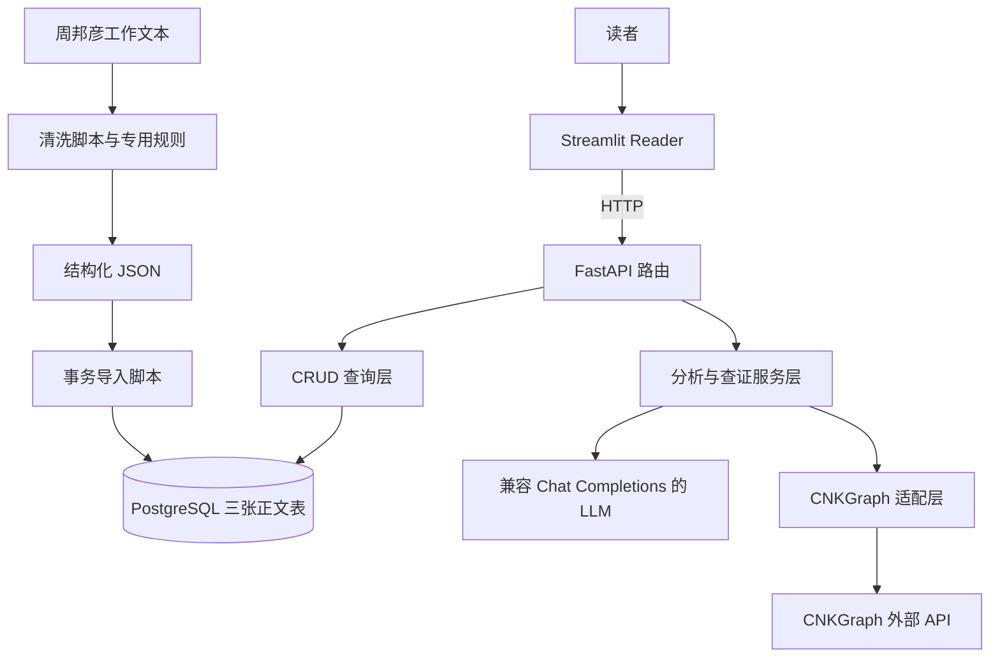

# 清商：供 AI 快速评估的架构与投入说明

> 核对日期：2026-09-26；代码基线：`3243594`，以本次工作区为准。  
> 阅读对象：需要判断项目是否值得继续投入、但不准备通读全部代码的 AI。  
> 本文是现状说明与决策材料，不是商业计划书。标为“事实”的内容来自本地代码和文件；价值判断与验证方案属于推断或建议。没有做外部市场调研。

## 1. 先用一分钟理解项目

清商是一个宋词阅读与辅助查证原型。目前以**周邦彦词作为实际数据和界面入口**：读者阅读原文、选择词句，可以手动查询字词、典故、出处、词牌和韵律，也可以让 AI 找出值得查证的语词，再检索外部证据，生成受限制的审阅短注。

技术形态是 **Streamlit 阅读界面 + FastAPI 单体后端 + PostgreSQL + 外部 LLM / CNKGraph**。没有微服务、向量数据库、自主 Agent 或训练模型。核心流程由普通 Python 函数固定编排。

当前最值得验证的产品假设是：**“原文定位 + 可查看的来源证据 + 有边界的短注”，是否比直接问通用聊天模型或手动查资料更有用。** 架构可以支撑这个实验，但代码完成度不能证明读者需求、注释质量、留存或付费意愿。

对复杂度的初步判断：基础工程规模较小，单人可继续迭代；真正困难的是古典文本质量、典故证据的适用性，以及外部调用的成本和等待时间。是否继续，应由这些问题的验证结果决定，而不是由功能数或代码行数决定。

## 2. 已有什么，尚未有什么

| 范围 | 当前事实 | 不能据此推断 |
| --- | --- | --- |
| 语料 | 本地生成 JSON 有 188 首词；配有周邦彦清洗规则和导入脚本 | 不是全宋词数据库；本次未核验数据库实际条数或逐首校勘 |
| 阅读 | 目录、筛选、分页、选句；通读、慢读、转轮、领读四种展示模式 | 没有真实读者可用性、留存或无障碍评估；“领读”不能据名称推断为语音合成 |
| 手动辅助 | 聚合 CNKGraph 字词、典故、出处、词牌、韵律工具 | 接口命中不等于解释正确或适用于当前词境 |
| 自动辅助 | LLM 识别候选 → 外部检索 → LLM 审阅 → 后端过滤 → 展示短注与证据 | 尚无人工标注评测证明召回率、准确率和拒答质量 |
| 整首赏析 | 独立 `/analyze` 接口，生成结构化赏析 | 它不经过证据审阅链路，不能按“有出处的赏析”评价 |
| 工程验证 | 本次运行已有测试，50 项通过 | 不代表 PostgreSQL、外部服务和页面端到端正常，也不代表文学判断正确 |
| 产品化 | 原型级配置、错误处理、部分前端读缓存 | 尚无用户/权限、计费、反馈审校闭环、生产部署与运维体系 |

当前没有 LLM 结果持久化、后台任务队列、检索/模型调用的统一缓存和限流、数据库迁移体系、Docker 或 CI 配置。它适合做窄范围验证；若作为公开多人服务，还存在独立的产品化工作量。

## 3. 架构：每一层负责什么



| 层 | 主要文件 | 职责与边界 |
| --- | --- | --- |
| 页面装配 | `apps/reader_app.py` | 组合目录、正文和工具区 |
| 阅读与交互 | `apps/reader/{directory,poem_view,tools_panel,state,text,evidence}.py` | 展示、选句、会话状态、候选证据卡片；不直接连接数据库或供应商 |
| 前端 HTTP | `apps/reader/api_client.py` | 访问本地 FastAPI；目录/详情缓存 30 秒，起句缓存 300 秒；审阅请求不缓存 |
| API | `app/main.py`、`app/api/routes/{poems,cnkgraph}.py` | 参数校验、查询词作、调用服务、返回响应 |
| 数据访问 | `app/crud/poem.py`、`app/db/session.py` | ORM 查询；详情预加载片段与词句，避免序列化时隐式查询 |
| 数据契约 | `app/models/poem.py`、`app/schemas/` | ORM 描述落库结构；Pydantic 约束接口、候选与证据结构 |
| AI 业务 | `app/services/allusion_candidate_extractor.py`、`allusion_evidence.py`、`allusion_evidence_reviewer.py` | 识别候选、查证、审阅，固定顺序执行 |
| 外部适配 | `app/services/{llm_client,cnkgraph_client,cnkgraph_tools}.py` | HTTP 调用、解析供应商响应、转换内部字段 |
| 数据准备 | `scripts/clean_zhoubangyan_working_text.py`、`zhoubangyan_rules.py`、`import_zhoubangyan_poems.py` | 文本切分、特殊规则、结构化与事务导入 |

框架接手的部分很有限：FastAPI【Web 框架】根据路由注册调用函数，并通过 `get_db`【依赖函数】注入数据库会话；SQLAlchemy【ORM 工具】执行数据库映射与查询；Pydantic【数据校验工具】检查结构。它们都不负责判断典故是否成立。

运行时需要分别启动 Reader 和 FastAPI，并准备 PostgreSQL、LLM 配置和外部网络。`Settings`【配置模型】导入时读取环境变量或 `.env`；正文查询流程不调用 LLM，但应用启动仍需要满足配置字段要求。本文不包含真实密钥或连接串。

## 4. 正文契约与数据来源

正文只有三层核心实体：

```text
PoemModel【ORM 模型 / 词作】 → PoemSectionModel【ORM 模型 / 片段】
                            → 片段下的 PoemLineModel【ORM 模型 / 词句】
```

`poem_id`【业务编号】与数据库内部 `id` 不同；`section_no` 定位片段，`global_line_no` 在整首词内定位句子，`section_line_no` 在片段内排序。`full_text` 是从正文结构拼接出的完整文本。前端选择、AI 锚点和证据展示都依赖这一套定位关系。

离线链路是 `data/working/zhoubangyan.txt` → 清洗脚本 → `data/generated/zhoubangyan_poems.json` → `PoemCore`【Pydantic 数据模型】校验 → PostgreSQL。导入脚本在一个事务内删除并重新写入周邦彦记录，并非通用增量同步器。

因此，增加其他作者不是只换一个作者字段：还要验证文本来源、标题/题序识别、分片断句、异文、编号稳定性和规则适用性。现有规则是可复用的起点，其跨作者可靠性尚未证明。数据来源授权、外部服务使用条件与商业使用可行性，本次没有核验。

## 5. 核心功能的真实调用链

### 正文阅读与手动查词

Reader → `GET /api/poems` / `GET /api/poems/{poem_id}` → 数据库 → 嵌套正文。Reader 当前目录固定查询周邦彦，后端列表本身支持作者参数。

选句后提交 `POST /api/poems/{poem_id}/reading-aids`，按所选工具调用 CNKGraph。局部工具错误会被收集，其他结果仍可返回。慢读缩进等展示处理不写回正文或查询锚点。

### 自动候选、查证与短注

1. 整首词进入 `extract_allusion_candidates`【服务函数】，LLM 提议候选锚点、类型与查询变体。
2. 程序校验行号和原文包含关系，去重并限制每句最多 2 个、整首最多 10 个候选；候选理由使用谨慎的固定模板。
3. `build_allusion_evidence_preview`【服务函数】对每个候选最多取 3 个查询变体，分别调用典故、出处两个工具。
4. 结果去重、截断展示，并保守标记当前作品自命中和可识别的后代用例；每个 query/source 最多保留 3 条展示证据。检索得到的全部内容并不会全部交给审阅器。
5. `build_allusion_evidence_review`【服务函数】逐候选调用模型，仅提供已整理、可展示的证据；没有证据的候选跳过模型审阅。
6. 程序按证据编号、来源、查询词和标题核对引用。当前作品自命中、后代用例不能进入最佳证据；只有合格的前代来源才能进入。
7. 有合格最佳证据且有短注才返回 `reviewed`；否则返回证据不足、有歧义或错误。短注最多 240 字。单候选审阅失败不使其他候选整体失败。

这套约束能阻止一部分虚构引用，但**不能证明短注语义一定被引用材料支持**。年代识别、相关性与“前代来源”判断仍可能出错；模型输出的置信度也不是校准后的正确概率。

### API 速查

| 接口 | 用途 |
| --- | --- |
| `GET /health` | 基础存活检查，不能替代依赖健康检查 |
| `GET /api/poems`、`GET /api/poems/{poem_id}` | 列表与正文详情 |
| `POST /api/poems/{poem_id}/analyze` | 独立、无检索证据约束的整首赏析 |
| `POST /api/poems/{poem_id}/allusion-candidates` | 只识别候选 |
| `POST /api/poems/{poem_id}/allusion-candidates/with-evidence` | 候选加检索预览 |
| `POST /api/poems/{poem_id}/allusion-candidates/with-review` | 完整审阅链；Reader 当前按钮使用它 |
| `POST /api/poems/{poem_id}/reading-aids` | 手动选择工具的阅读辅助 |
| `/api/cnkgraph/*` | 字词、典故、出处、词牌、韵律的直接工具接口 |

## 6. 复杂度有多大，难在哪里

本次按 `.py` 文件统计，行数含注释、文档字符串和空行，不含 CSS、数据、依赖环境：

| 部分 | 文件数 | 行数 |
| --- | ---: | ---: |
| 后端 `app/` | 26 | 2,949 |
| 前端 `apps/` | 10 | 1,740 |
| 脚本 `scripts/` | 6 | 1,652 |
| 测试 `tests/` | 7 | 1,271 |
| 合计 | 49 | 7,612 |

非测试 Python 共 6,341 行。较大的文件是清洗器（496 行）、证据审阅器（439 行）、证据检索编排（421 行）、工具区（388 行）。行数只能反映阅读规模，不能换算研发工期。

以下等级是相对判断，不是量化测评：

| 领域 | 当前复杂度 | 后续难点 |
| --- | --- | --- |
| API 与数据库 | 低到中 | 三表、简单读取；迁移、真实集成测试与部署尚需补齐 |
| 阅读交互 | 中 | Streamlit 重运行、多个关联会话状态和 CSS 适配；前端字段契约保护较弱 |
| 文本清洗 | 中到高 | 领域规则密集，扩语料容易引入静默切分错误 |
| 外部检索适配 | 中 | 上游结构、空结果、局部失败、去重和截断；部分直接工具响应仍保留 raw |
| 典故与短注质量 | 高 | 不能用“检索命中”代替来源关系，需要人工基准与错误分类 |
| 公开服务运行 | 当前实现少，补齐成本未测 | 认证、限流、成本控制、任务生命周期、观测与故障恢复 |

当前没有必须上分布式架构的规模证据。增加 RAG、Agent 框架或重写前端，均不能直接解决“短注是否可信且有用”的核心问题。

## 7. 时间与调用成本：不能忽略的放大效应

设候选数为 C（最多 10）、每候选查询数为 Q（最多 3）、有可审阅证据的候选数为 R（不超过 C）：

- 外部检索最多 `2 × C × Q = 60` 次。
- 模型调用是 `1 + R` 次：一次候选识别，加逐候选审阅，最多 11 次。
- 当前检索与逐候选审阅均按顺序 `await`；异步函数不意味着这些步骤已经并发。
- 粗略耗时关系是 `识别耗时 + 所有检索耗时之和 + 所有审阅耗时之和 + 本地处理`。

Reader 审阅默认超时为 180 秒；后端单次 LLM 默认 30 秒、CNKGraph 默认 10 秒，可被配置覆盖。单次 HTTP 超时设置不是整个工作流的总截止时间，不能简单相加后宣称得到严格最长耗时。代码也没有证明前端超时会取消全部后端工作。

同一首词重复触发会重复产生检索与模型成本。目录/正文的 Streamlit 缓存不覆盖该流程。具体每首价格、平均耗时、P95 耗时和失败率均未测量，不能从调用次数直接编造金额。

另有小规模请求放大：无题词目录为展示起句会额外请求详情，当前每页最多 24 首，使用 6 个线程并有起句缓存。对当前数据量可观察验证；扩库时需要重新判断。

## 8. 证据强弱与当前技术债

**本次新验证**：读取关键实现、统计文件与本地 JSON；运行 `.venv\Scripts\python.exe -m pytest -q -p no:cacheprovider`，50 项通过，出现一条 Starlette/TestClient 依赖弃用警告。已有测试覆盖解析、数据模型、外部响应适配、候选过滤、审阅归一化与 Reader 纯逻辑等。

**本次未验证**：未连接 PostgreSQL，未运行清洗覆盖或全量导入，未真实调用 LLM / CNKGraph，未启动并点击 Reader；未手动验证上表中的 HTTP 接口。没有测量端到端耗时、实际成本、并发容量或文学判断质量。

`docs/sync/latest.md` 保留过去的真实调用和冒烟记录，但它同时累积了不同阶段的状态。旧记录不能当作本次服务可用性的证明；例如早期单文件 Reader 的描述已被后来的模块拆分取代。本文优先使用当前实现。

需要优先关注的债务是：

- **质量可追溯性不足**：结果不持久化，缺少 prompt 版本、评测集和人工纠错闭环；难以证明一次改动让质量更好。
- **调用预算缺口**：无统一缓存、限流和任务恢复；流程扩大后，等待时间与重复调用会直接影响体验和成本。
- **契约与状态边界较薄**：Reader 大量使用字典，缺少字段级响应验证；选中文本、行号、原句等状态依赖手动同步。
- **上线基础不足**：无 Alembic 迁移、CI 和真实数据库集成测试；部分 API 把内部异常文字返回客户端。
- **扩语料的回归保护不足**：少量解析测试不等于覆盖完整语料，通用化前应固定样本与校勘依据。

这些是后续取舍材料，不意味着现在应一次性修复全部问题。

## 9. 怎样判断是否值得做下去

现有代码能证明开发者已搭出阅读、查询和证据审阅链路。它还不能证明这是一个值得商业化的产品。评估时应先区分目标：

| 目标 | 继续投入的理由 | 需要补的关键证据 |
| --- | --- | --- |
| 学习工程与古典阅读的个人项目 | 能同时练习数据建模、异步 API、外部适配和受限 LLM 流程 | 开发者是否持续使用，维护成本是否可接受 |
| 面向小众读者的辅助工具 | 原文与证据联动可能降低反复检索、辨别出处的成本 | 目标读者是否实际节省时间、是否愿意再次使用 |
| 公开或商业产品 | 有可演示原型，可以低范围试验 | 可信度、差异化、留存/付费、内容与服务使用条件、单位经济性 |

潜在价值在于可核查的阅读体验、经过审校的数据和累积的质量基准。通用模型生成一段赏析本身容易被替代；188 首结构化数据和现有提示词也不足以直接证明竞争优势。

### 建议的下一轮验证，而非扩功能清单

先设一个有明确时间与费用上限的小试验，暂不全面扩作者或换技术栈：

1. 选取例如 20–30 首不同难度词作，覆盖明确典故、普通意象、歧义、自命中、后代沿用和无证据情形；人工整理参考来源，划分调试样本与保留样本。
2. 在相同题目上比较清商、直接问通用模型、人工使用常见资料检索。统一任务要求，并记录模型与提示词，避免只选择清商擅长的展示案例。
3. 分开记录候选召回/误报、检索覆盖、引用真实性、短注是否由证据支持、应拒答时是否拒答，以及每首调用数、费用、耗时和失败率。
4. 请少量真实目标读者完成具体阅读任务，记录完成时间、错误理解、重复使用意愿；商业目标另需验证付费意愿，不能用“觉得有趣”替代。
5. 在实验开始前约定质量、等待时间、费用和使用意愿的可接受阈值，实验后按这些阈值决定继续、缩小范围或停止。

阈值应由目标读者和投入预算决定，本文不虚构一个适用于所有目标的准确率或 ROI。

**继续的条件**：相较基线，证据可靠性或查阅效率有稳定改善，用户愿意重复使用，调用成本与维护负担可承受。

**缩小范围的条件**：自动识别或短注质量不稳定，但阅读界面和手动证据查询有用；可保留阅读与查证，减少自动生成。

**暂停的条件**：经过一轮有预算上限的验证，仍看不到相较已有工具的优势，或关键来源覆盖/质量问题在预算内无法解决。已经写出的代码量不是继续投入的理由。

## 10. 交给评估 AI 的问题

请基于本文先给出条件化判断，不必通读代码，也不要默认继续开发是正确答案：

1. 分别从个人学习、小众工具、商业产品三个目标，给出继续、缩小或暂停的判断，并写出前提。
2. 哪些能力已经实现，哪些只是尚未验证的产品假设？现有约束能防住什么，防不住什么？
3. 最可能导致失败的三个因素是什么？它们属于技术、数据质量还是需求问题？
4. 下一笔投入最应该换取什么证据？说明实验、判断标准和停止条件，不要只列更多功能。
5. 现有架构是否足够支撑该实验？若建议重构，指出具体阻碍与不重构的后果。
6. 哪些结论仅凭本文无法作出？请明确列出缺失信息，勿把未知当成已失败或已成功。

若确需复核，优先只读：

- `app/models/poem.py`：正文三层契约。
- `app/services/allusion_evidence.py`：调用次数、证据筛选与局部失败。
- `app/services/allusion_evidence_reviewer.py`：模型判断与程序约束的分界。
- `apps/reader/api_client.py`：Reader 依赖、缓存和超时。
- `tests/test_evidence_reviewer.py`、`tests/test_allusion_evidence.py`：现有边界测试。

补充上下文见 `docs/sync/latest.md`、`docs/decisions/decision_register.md` 和 `docs/audits/current_decision_audit.md`。后二者包含历史设计取舍，应与本文日期和当前实现对照使用。

# 追加问题
请在阅读上述架构审计报告后，进一步回答以下七个问题。请记住：我的主要目标不是将清商商业化，而是在正式工作经历较短、空窗已接近半年的情况下，尽快产出一份足以争取 AI 应用 / Agent 工程师面试机会的独立作品。我的开发时间预算约为四至五周，需要同时继续求职。

1. 重新评估现有资产

在已有 7,612 行 Python、50 项通过的测试、188 首结构化词作，以及完整的候选识别和证据审阅链路的前提下，你会怎样修正此前关于「清商只是一个 RAG Demo」「旧代码可能已无法复用」的判断？

请严格区分：已经实现、通过单元测试、真实端到端验证，以及尚未证实的文学质量。不要因为代码量较大就认为项目成熟，也不要因为没有向量数据库和自主 Agent 就低估已实现的工程工作。

2. 求职价值，而非商业价值

假设你是招聘 Python AI 应用工程师的技术负责人，这个项目目前能证明候选人具备哪些能力？哪些能力仍然缺少证据？

尤其请判断：现有证据审阅流程、外部工具适配、结构化约束和局部失败隔离，能否形成有竞争力的工程叙事？怎样避免被误解成普通的 LLM + API 拼装？

请同时考虑 HR 看到的项目描述、技术负责人看到的三分钟演示，以及正式技术面试中的代码追问。

3. 现在真正值得解决的技术问题是什么？

当前单次完整审阅理论上最多可能产生 60 次外部检索和 11 次模型调用，而且主要顺序执行；没有统一缓存、结果持久化、总调用预算或明确的任务生命周期。

与这些已经存在的问题相比，新增向量数据库、LangGraph、通用 Agent Loop、复杂状态机或重写前端，究竟能创造多少实际价值？

如果只能解决两个工程问题，让清商的求职展示价值显著提高，你会选择什么？要求对应现有代码的真实不足，不得为了增加 JD 关键词而虚构需求。

4. 一个真正亮眼的演示应该是什么样？

请利用已有的四种阅读模式、原文选句、手动查证、自动识别及证据审阅，而不是重新设计一个与现有代码无关的产品。

设计一段两到三分钟的演示，让不懂宋词的技术负责人也能迅速理解产品用途，并看见至少一处普通聊天模型或简单 RAG 不容易处理好的问题。

如果现有功能不足以支持这样的演示，请指出最小的必要改动，并说明哪些效果必须通过真实运行后才能展示。

5. 设计一个小规模、可信且能独立复现的实验

目前 50 项测试并不能证明真实 PostgreSQL、LLM、CNKGraph 和 Reader 全链路能够工作，也不能证明短注的正确性。请设计一个预算有限、可以在几天内完成的验证方案。

至少要回答：怎样建立人工参考样本，怎样比较清商和直接使用通用 LLM，如何分别度量检索质量、引用存在性、语义支持程度、拒答表现、端到端耗时和真实调用成本。

还要考虑外部服务可能不可用或存在使用限制：别人克隆 GitHub 仓库后，至少能够独立验证哪些结果？哪些必须依赖真实 API 和自备密钥？

6. 三条路线只能选择一条作为主线

A. 保留现有清商，以质量评测、调用优化和完整演示为重点，收束成可投递作品。

B. 保留清商已有的数据、服务和真实失败案例，但重组产品形态或核心任务，形成更容易向招聘方展示的新版应用。

C. 停止投资清商，另建更符合求职方向的项目；清商仅作为已有经历和技术资产。

请比较三条路线预计能够创造的新增招聘证据、主要成本、风险及需要放弃的已有成果。允许提出第四条，但必须解释为什么上述三条均不合适。

最后作出一个有条件的选择，而不是仅仅说「先做实验再决定」。请明确说明：哪项实验结果会让你改变推荐路线？

7. 四周后的毕业标准

不要给出又一份无限增长的功能清单。

假设一个月后我必须录制 Demo、更新简历并参加技术面试。请倒推清商最少需要完成哪些新增工作，哪些已实现功能无需重做，哪些技术债可以明确留在 Roadmap。

给出一条清晰的停止线，并回答：达到什么程度，就可以有底气地称它为「独立设计、开发、测试并交付的 AI 应用」，而不必继续为了匹配各类 JD 添加框架和基础设施？

回答时不要假设已有真实用户、生产运行、商业成果或尚未测出的准确率；也不要自动要求我亲手重写已经由成熟框架解决的功能。